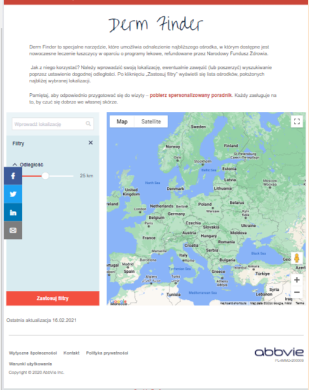
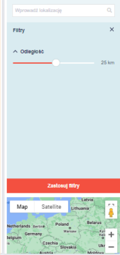

# **Feature Name: Derm Finder Tool**

A detailed test analysis of the Derm Finder tool, focusing on its key features and functionalities. As a **software tester**, my role was to ensure the usability, quality, reliability, and performance of the tool through rigorous testing methodologies.

**Feature Background:** Derm Finder is a special tool that allows you to find the nearest center where modern psoriasis treatment is available based on drug programs reimbursed by the National Health Fund.

**Technology Used:** AEM, AngularJS, Java, Javascript, HTL, Sling, JCR, Maven, etc.

**Database Project:** PIAP 

**Database Technology:** GraphQL, PostgreSQL

**URL:** [https://www.let-me-be-clear.com/pl/pl-pl/derm-finder.html](https://www.let-me-be-clear.com/pl/pl-pl/derm-finder.html)

                                                    DermFinder Tool Short Demo

### **1. User Interface and User Experience (UI/UX):**

* Conducted usability testing to evaluate the clarity and intuitiveness of the tool's user interface.
* Verified that users could easily input their location, adjust search filters, and navigate through the tool without confusion.
* Identified areas for improvement to enhance the overall user experience.

### **2. API Testing:**

*  Utilized Postman for API testing to verify the accuracy of data fetched from the database and displayed to the user.
*  Conducted thorough testing of API endpoints to ensure proper data retrieval and handling of requests.
* Validated the functionality and performance of API interactions to guarantee seamless integration with the Derm Finder tool.
*  Collaborated with the development team to address any API-related issues and ensure smooth communication between the frontend and backend systems.

### **3. Search Functionality:**

* Examined the effectiveness of the search functionality in returning relevant results based on user-specified criteria.
* Tested various search scenarios to ensure robustness and flexibility in handling different user inputs.
* Provided feedback on improving search algorithms and filters to enhance search accuracy and efficiency.
* Tested the tool's ability to accurately identify and display the nearest centers offering modern psoriasis treatment based on user input.
* Conducted regression testing to verify the consistency of results across different scenarios.

### **5. Data Integrity and Database Management:**

* Verified the integrity and completeness of the database powering the Derm Finder tool.
* Conducted data validation checks to ensure accuracy and consistency of information stored within the database, including hospital names, addresses, and services provided.
* Collaborated with database administrators and developers to address any data quality issues and ensure optimal database performance through regular maintenance and monitoring.

### **6. Accessibility:**

* Conducted accessibility testing to ensure the tool's compliance with accessibility standards.
* Verified compatibility with screen readers, keyboard navigation, and other assistive technologies with the **Siteimprove** **Accessibility Checker **chrome extension tool.

### **7. Security:**

* Assessed vulnerability assessments received from the security test team and ensured they were resolved.

### **8. Responsiveness:**

* Tested the tool's responsiveness and functionality on mobile /tablet devices, ensuring compatibility with various screen sizes and resolutions.
* Verified that users could access and use the tool conveniently from smartphones and tablets.
* Identified and addressed any mobile-specific issues to enhance the mobile user experience.

 

                         

### **9. Localization:**

* Conducted localization testing to ensure the tool's compatibility with different languages, cultures, and regulatory requirements.
* Verified the accuracy and cultural appropriateness of translated content and user interface elements.
* Provided feedback on localization issues and recommended adjustments for improved global usability.

### **10. Collaboration and Communication:**

* Maintained open communication channels with stakeholders, including developers, product managers, and end users, to gather feedback and address concerns.
* Actively participated in cross-functional team meetings to discuss project progress, identify potential risks, and coordinate testing efforts.
* Provided regular updates on testing progress, identified issues, and proposed solutions to ensure alignment with project goals and objectives.

### **11. Continuous Improvement:**

* Actively participated in retrospectives and post-release reviews to identify areas for improvement in the testing process and tool functionality.
* Incorporated lessons learned from previous testing cycles to enhance future testing efforts and optimize the Derm Finder tool's performance and usability.

### **Challenges Faced:**

Throughout the testing process of the Derm Finder tool, several challenges were encountered, hindering the smooth execution of testing activities. These challenges included:

* **Data Consistency:** Ensuring consistency and accuracy of data across different database entries posed a significant challenge. Inconsistencies in data formatting and duplication of entries complicated the testing process.
* **Security Vulnerabilities:** Identifying and mitigating security vulnerabilities within the tool's infrastructure was another challenge. The complexity of the technology stack and integration points required thorough security testing to ensure data privacy and integrity.

### **Solutions:**

To overcome these challenges, the following solutions were implemented:

* Data Cleaning and Standardization: Rigorous data cleaning and standardization processes were employed to address inconsistencies and duplication within the database. This involved implementing data validation checks and deduplication techniques to ensure data integrity.
* Security Patching and Regular Audits: Security vulnerabilities identified through vulnerability assessments were promptly addressed through patching and updates. Regular security audits and penetration testing were conducted to proactively identify and mitigate potential security risks, ensuring the tool's robustness against cyber threats.

In conclusion, the rigorous testing of the Derm Finder tool has confirmed its usability, reliability, and effectiveness in providing psoriasis treatment information. Through collaborative efforts and continuous improvement, I've ensured that the tool delivers a seamless user experience, empowering individuals to make informed treatment decisions. My test efforts have contributed to the success of the Derm Finder tool, making it a valuable resource in the healthcare landscape.

                                                   
                                              Copyright © Noor Ismot Ara- All rights reserved 
